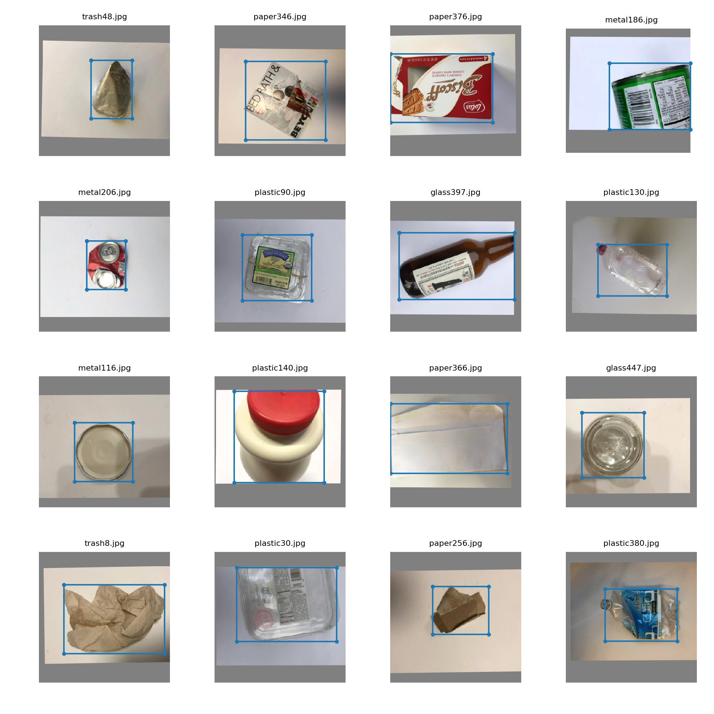

# Introduction


This project is a 5G embedded intelligent garbage can classification system based on YOLOv3.  The bin has two options, which can be connected to a local USB camera to get images, or a 5G network to get images from a webcam.  You need to obtain the IP address and port of the 5G camera in advance.  


The above is the simple detection interface of the trash can.
# Requirements

| operating system | Ubuntu 18.04 LTS                            |
| -------- | ------------------------------------------- |
| CPU      | Intel i7-6700U + 8GB                         |
| GPU      | GTX 1080Ti，12GB RAM                       |
| development platform | pycharm + keil5 (python3 + c51)             |
| development board   | STC89C52RC                                  |

For python dependency library installation use the following command:

```python
pip3 install -r requirements.txt
```

If you want to port to your own computer, you need to modify the relevant pathname in the cap.py file, and the PATH of the USB serial port.  
It is necessary to burn the single-chip code into 51 single-chip computer in advance, how to connect the server through serial port.  


Figure is the frame diagram of the whole system, which needs two digital steering gear, an industrial camera, a 5V voltage stabilizer module, a power supply module and a single chip microcomputer minimum module.  

# Training

**Start Training：**`python3 train.py`  to begin training after downloading the dataset.

**Resume Training**:`python3 train.py --resume` to resume training from `weights/xxx.pt`


Figure is the training loss curve.

# Dataset

We collected more than 1,000 data sets of common garbage categories, including metal, plastic, paper, and glass, and obtained tens of thousands of images through image augmentation.  



There are about 300 pictures in each category.

# 


```
pip3 install -r requirements.txt
```


# Training

##### Star Traning:

```python
python3 train.py
```


# 


